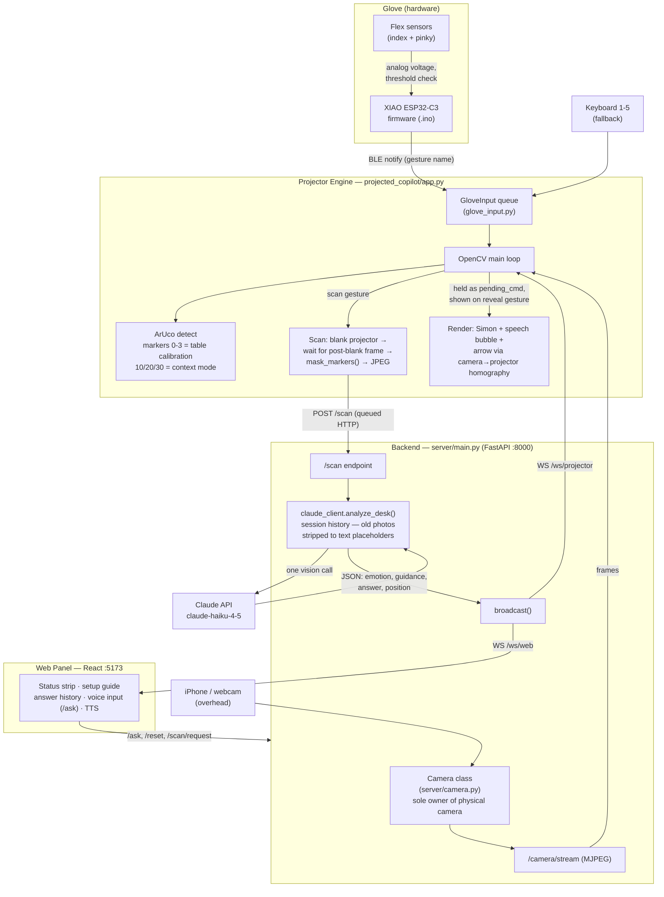

# Projected Copilot

AI guidance, projected exactly where you need it.

A camera + projector tabletop assistant powered by Claude Vision. Point a camera at your desk, place a context marker, and interact with Simon the dragon using a wireless gesture glove (or the keyboard while you build one). Simon watches, thinks, and speaks the answer when you're ready.

---

## Quick Start

### 1. Setup API key

Create `server/.env`:

```
ANTHROPIC_API_KEY=sk-ant-...your-key...
CAMERA_INDEX=1
```

Get your API key at **console.anthropic.com** (add ~$5 of credits — enough for hundreds of scans).

`server/.env` is gitignored — your key never gets committed.

### 2. Install dependencies

```bash
pip install -r requirements.txt
cd web && npm install
```

All npm scripts live in `web/package.json`, not the repo root. Run them from
`web/`, or use `npm --prefix web ...` from the root:

```bash
cd web
npm run dev
npm run build

# or, from the repo root:
npm --prefix web run dev
npm --prefix web run build
```

### 3. Start everything

```bash
./start.sh
```

Open **http://127.0.0.1:5173/** in Chrome.

`./start.sh` starts the FastAPI backend, the React web panel, and the projector
engine. The projector engine runs in the foreground; quit the projector window
to stop the full stack.

The projector engine reads the desk camera from the backend's video stream (the
backend owns the camera — one process per camera on macOS), so set the camera
with `CAMERA_INDEX` in `server/.env`. There's no projector `--camera` flag to
match anymore.

Move the "Projected Copilot - Projector" window onto the projector display, then press `f` for fullscreen.

Once the app is running, you can smoke-test the live setup from another terminal:

```bash
python scripts/check_system.py
```

**No glove yet?** Gestures are simulated with keyboard keys `1`–`5` in the projector window — you can use the whole app before building any hardware.

**Using the glove?** Start the full app with the glove enabled:
```bash
pip install bleak   # BLE backend, one-time
GLOVE_BLE=true ./start.sh
```
Power on the glove and it auto-connects over Bluetooth. The glove firmware is
flashed once with the **Arduino IDE** (the board is a Seeed XIAO ESP32-C3, not
an Arduino — the IDE with the "esp32 by Espressif" board package is just the
easiest way to upload the sketches). Full build guide, wiring, and firmware in
`firmware/glove/README.md`.

**Backend and web already running?** Start only the projector engine:
```bash
./run.sh --windowed
```

**Manual development mode** is still available if you want separate terminals:

```bash
# Terminal 1 — backend
python -m uvicorn server.main:app --host 0.0.0.0 --port 8000

# Terminal 2 — web panel
npm --prefix web run dev

# Terminal 3 — projector engine
./run.sh --windowed
```

---

## Architecture

Three processes, one camera:



Reads top to bottom as the scan flow: finger bend → BLE → gesture queue →
blank/capture/mask → `/scan` → Claude (with text-only session memory) →
WebSocket broadcast → on the "reveal" gesture, Simon's speech bubble and arrow
render via the calibration homography.

- The backend is the **only** process that touches the camera (macOS allows one
  owner); the projector engine reads the same MJPEG stream.
- Before a scan, the projector blanks itself and waits for a camera frame
  taken **after** the blank, so Claude never sees its own projected overlays.
- Backend URL defaults to `http://localhost:8000`; override with the
  `BACKEND_URL` env var for the projector engine.

---

## Demo Script (2 minutes)

1. Run `./start.sh`, open http://127.0.0.1:5173/, follow the **Setup guide**
   until every row is green.
2. Put the **study marker (10)** next to a worksheet with a visible question.
3. Press `p` (pointing on), then `4` (or fist gesture) — Simon blanks the
   projector, snaps the desk, and thinks.
4. Press `5` (or pinky gesture) — the answer bubble appears, with an arrow
   projected at the exact spot on the paper it refers to.
5. Press `3` — Simon speaks the answer. Swap in the electronics marker (20)
   and repeat to show context switching.

---

## How It Works

1. Place a context marker on your desk (see Markers section below)
2. Use glove gestures (or keyboard keys `1`–`5`) to interact with Simon
3. Simon scans the desk silently — answer is stored until you're ready
4. Reveal the answer when you want it, speak it when you need it

The web panel includes a readiness strip for the backend, camera, Claude API,
projector connection, pointing, and scan state. If something is missing, fix
that row before trying a real scan.

### Guided setup

The web panel's **Setup guide** walks through the live checklist:

1. Backend connected
2. Camera ready
3. Claude configured
4. Projector linked
5. Table markers locked
6. Pointing enabled
7. Test target checked
8. Ready to scan

For the pointing steps, place table markers `0`, `1`, `2`, and `3`, press `p`
in the projector window, then press `t` to show the center test target. Once the
target lands where expected on the table, click **Mark aligned** in the web
panel. The alignment check is saved in the browser and clears automatically if
calibration is lost. Use **Reset setup** to clear the alignment check, current
answer, and Simon's conversation memory.

If pointing was enabled for a scan but Claude does not return a usable point,
the web panel shows a warning. Simon can still answer; there just is not a safe
visual point to draw for that scan.

The web panel also keeps the last three answers for the current browser session.
Use **Scan again** to ask the projector to run the safe blank/capture/masked
scan flow, **Speak** to read the current answer aloud, and **Clear** to dismiss
the current answer without resetting Simon's memory.

---

## Gestures & Actions

Gestures come from the **wireless glove** (over Bluetooth) or, while you build one, the **keyboard** keys `1`–`5` in the projector window. Both feed the same five actions:

| Action | Key | Glove gesture | What happens |
|---|---|---|---|
| **Stop** | `1` | _keyboard only_ | Silences Simon mid-speech |
| **Ask** | `2` | Index finger up | Simon says "How can I help you?" and the mic activates |
| **Speak** | `3` | _keyboard only_ | Simon reads the answer aloud in his voice |
| **Scan** | `4` | Fist | Simon analyzes the desk with AI (one Claude call) |
| **Reveal** | `5` | Pinky up | Answer bubble appears above Simon's head |

The glove is a **2-sensor** build (index + pinky), so it fires three gestures —
**Ask**, **Scan**, and **Reveal**. Open palm is the neutral resting pose and
sends nothing. **Stop** and **Speak** stay on the keyboard (`1` and `3`). The
exact finger-to-gesture mapping lives in `firmware/glove/README.md`.

**Typical flow:**
1. Place the right marker on your desk
2. **Scan** when you're ready for Simon to look at the desk
3. Work on your task — Simon holds the answer silently
4. **Reveal** when you want to see the answer
5. **Speak** when you want Simon to say it out loud
6. **Stop** to cut Simon off if he's talking too long

---

## Context Markers

Place a printed marker next to what you're working on. Simon uses it to give smarter, targeted answers.

| Marker ID | Context | Use when... |
|---|---|---|
| **10** | Study / worksheet | Doing homework, reading notes, flashcards |
| **20** | Electronics | Working on a breadboard or circuit |
| **30** | Tabletop | Playing a board game or using a map |

Generate and print the markers:
```bash
~/miniconda3/bin/python3 scripts/generate_markers.py
```
Print `markers/markers_sheet.png` on matte paper.

---

## Keyboard Controls (Projector Window)

| Key | Action |
|-----|--------|
| `1`–`5` | Simulate glove gestures (stop / ask / speak / scan / reveal) |
| `space` | Reveal stored answer (same as the Reveal gesture) |
| `r` | Reset Simon's conversation memory (start a fresh task) |
| `p` | Toggle **pointing** — Simon draws an arrow at the spot his answer refers to |
| `t` | Toggle a fixed **test target** at the table center for projector alignment |
| `d` | Toggle marker debug overlay on dashboard |
| `f` | Toggle fullscreen on projector |
| `q` / `esc` | Quit |

---

## Hardware Setup

- MacBook
- **iPhone as webcam** (Continuity Camera) or a USB webcam, mounted overhead pointing at the desk
- Mini projector connected as second display (e.g. HY300)
- White or matte desk surface
- Printed context markers (IDs 10, 20, 30)
- **Optional:** wireless gesture glove — Seeed XIAO ESP32-C3 + 2 flex sensors (index + pinky). Firmware is flashed via the Arduino IDE (esp32 board package, board `XIAO_ESP32C3`); build guide and sketches in `firmware/glove/`. Until it's built, use keyboard keys `1`–`5`.

### Using an iPhone as the camera (Continuity Camera)

1. Keep the iPhone on the same Apple ID and near the Mac, with Bluetooth and Wi-Fi on.
2. Mount it overhead facing the desk (a clamp/arm works well). Lock the screen — Continuity Camera still streams.
3. The iPhone shows up as another camera index. macOS often orders it **ahead of** the built-in FaceTime camera, so it usually lands at index `0` or `1`.

**Wrong camera?** The camera lives in **one** place now: `CAMERA_INDEX` in `server/.env` (the backend owns it; the projector reads its stream). The iPhone and the built-in camera swap indices depending on what's connected — the iPhone often lands at `0`, pushing the built-in FaceTime camera to `1`. Preview a given index with `python scripts/check_camera.py --camera 0` (try 0, 1, 2) to find the one showing the iPhone feed, set `CAMERA_INDEX` to it, and **restart the backend**.

---

## Notes

- Use **Chrome** — voice input and TTS require it
- Keep the room dim but the desk evenly lit for best camera results
- Simon **remembers earlier scans** this session — he skips questions he already answered. Press `r` to clear his memory and start a fresh task.
- **Pointing** is off by default — press `p` to have Simon draw an arrow at the relevant spot on the desk. It only aims accurately once the 4 table markers (IDs 0–3) are calibrated; without calibration it stays hidden rather than point at the wrong place. The web panel's **Pointing** row shows whether it is ready.
- Press `t` in the projector window to draw a fixed test target at the table center. Use this before a real scan to confirm the projected image is aligned with the physical table.
- Claude model: `claude-haiku-4-5` (~$0.001 per scan). Only the newest scan's
  photo is sent to the API — older photos in Simon's memory are replaced with
  text placeholders, so cost stays flat no matter how long the session runs.
- Auto-watch is **off** — Claude only runs when you trigger a Scan
